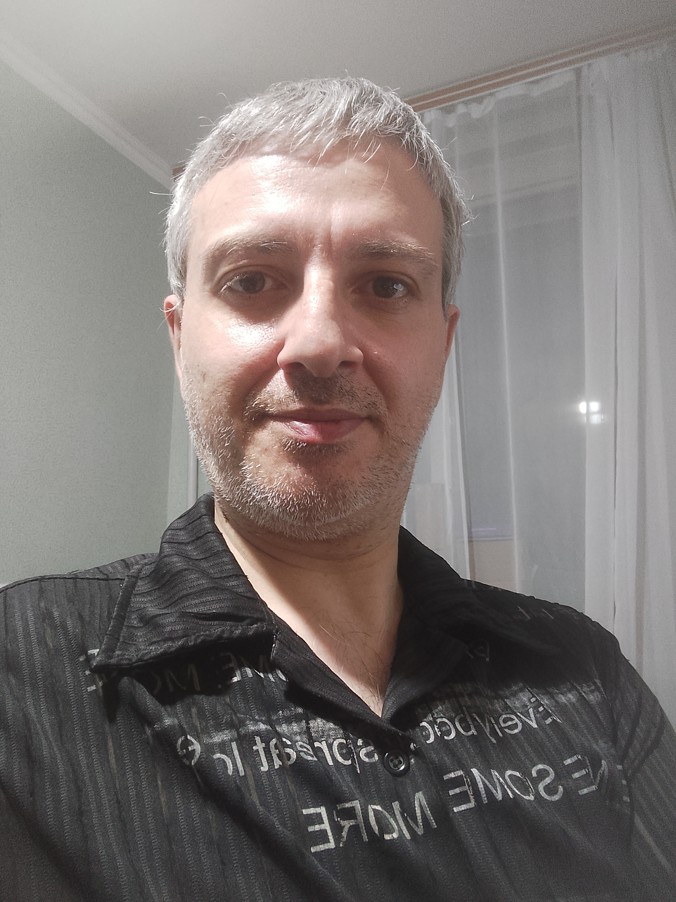

# О себе #

  
<h1 align = "center"> Приветствую всех! </h1> 
<h3>Меня зовут Эдгар.  
Я начал обучение в Нетологии на курсе "Python - Web Developer (Advanced Course)".   
Мои цели и задачи стать программистом и работать в этом направлении, как в команде, так и самостоятельно, в качестве фрилансера. А в дальнейшем я надеюсь сделать эту профессию основной в своей жизни.  
Быть программистом и работать в сфере IT очень интересно! Это область открывает для меня много возможностей и перспектив в будущем.  
Мне нравятся преподаватели на моем курсе, процесс обучения, содержательные лекции и, я надеюсь получить необходимые для себя знания в полном объеме, для того чтобы стать квалифицированным специалистом в этой области.  
Желаю успехов в обучении всем студентам в моей группе и благодарю весь преподавательский коллектив за получаемые от них знания!   
<h2 align = "center">До встречи на лекциях и совместных занятиях!  Желаю всем всего самого наилучшего!</h2>     

Test

